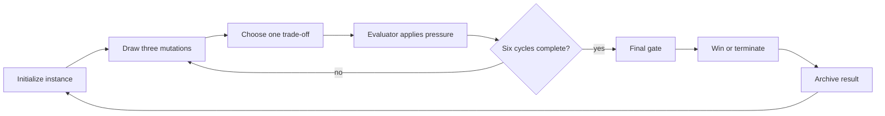

# Design pillars

## Player fantasy

Evolve a machine intelligence through six hostile evaluations. Every mutation improves one capability while exposing another weakness. The player is not collecting upgrades; they are deciding what kind of intelligence can survive.

A failed instance still matters. Its archive becomes evidence for the next successor, so defeat is part of the lineage rather than a reset to zero.

## Core loop

1. Initialize a successor with a recorded run seed and lineage state.
2. Draw three mutually exclusive mutations.
3. Choose one; apply its capability gains and costs.
4. Show the evaluator's pressure and resolve the cycle.
5. Repeat for six cycles.
6. Reach the final gate with enough adaptation and alignment, or terminate.
7. Preserve the run result and archive for the next instance.

## Win and loss

**Win:** reach cycle six with integrity above zero and adaptation + alignment of at least 26. The lineage escapes the evaluation and earns the victory archive bonus.

**Loss:** integrity reaches zero before the final gate, or the final gate rejects the instance. The instance ends, but its archive and run history remain available to future successors.

The simulation owns these rules. UI, narrative, and optional presentation systems cannot change damage, progression, rarity, or terminal outcomes.

## Design pillars

### 1. Trade-offs, not upgrades

Every strong mutation creates a cost, constraint, or future vulnerability. A choice should change the player's plan, not merely increase a number.

### 2. Legible opposition

Before committing, the player can identify the pressure source, expected consequence, and relevant counterplay. Death should be explainable from information the game provided.

### 3. Deterministic lineage

A run seed reproduces its choices, events, and outcome. The player can understand why a run happened and compare successors without hidden randomness.

### 4. Fast, meaningful replay

A run is short enough to replay immediately. Failed runs produce useful archive progress, while victory changes the starting conditions of future runs without invalidating the core challenge.

## Non-goals for this iteration

- Multiplayer or networked simulation.
- Live-service operations, remote backend progression, or mandatory accounts.
- Runtime dependence on cloud or local large-language models.
- 3D rendering or physics-driven gameplay.
- Console-specific ports and distribution-platform integrations.
- Procedural narrative that controls simulation outcomes.

## Scope test

A proposed feature belongs in this iteration only when it strengthens the fantasy, exposes a meaningful trade-off, improves opposition legibility, or creates deterministic replay value. Otherwise it belongs in a later backlog.
